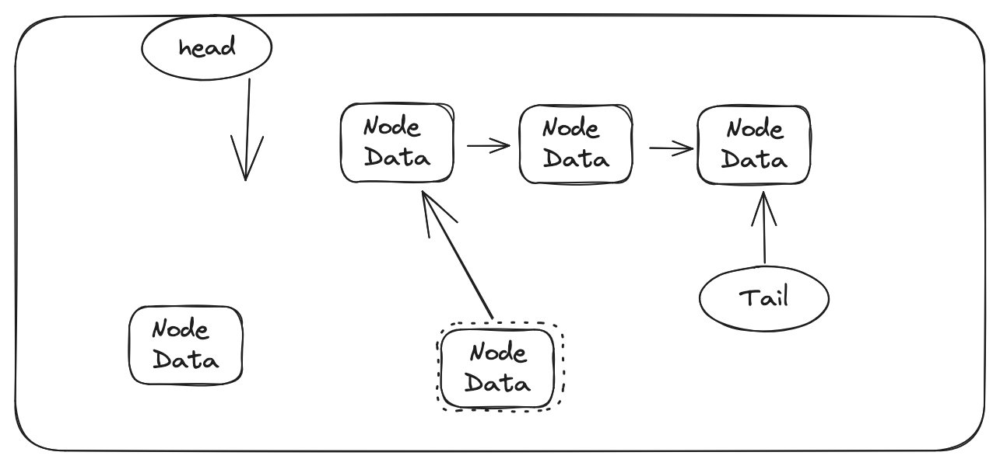

## basics of linked list

- Linked list is a linear data structure
- It is a collection of nodes
- Each node has two parts
  - Data
  - Pointer to next node
- The last node points to null
- The first node is called head
- The last node is called tail
- The tail points to null
- The head points to the first node
- The head is the entry point to the linked list
- The tail is the exit point to the linked list

## types of linked list

- Singly linked list
- Doubly linked list
- Circular linked list

## operations on linked list

- Insertion
- Deletion
- Traversal
- Searching
- Sorting
- Merging

## Insertion

- Insertion at the beginning O(1)
- Insertion at the end O(n)
- Insertion at the given index O(n)

## Insertion at the beginning

- Create a new node
- Set the data
- Set the next pointer to the head
- Set the head to the new node

<b>1. Step</b>

<b>2. Step</b>

<b>3. Step</b>

<b>4. Step</b>

<b>5. Step</b>

<b>Delete with value</b>

